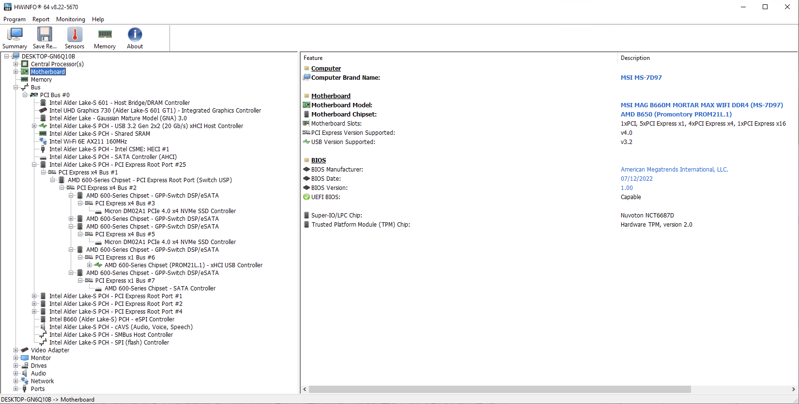

# ReProm

> This project aims to NTR Prom FCH to other platform(s).

## Repo Contents:
1. Python script for extracting firmware from UEFI BIOS images
2. Fusion360/KiCad Library (footprints, symbols)
3. Reference Schematic(s)
4. XLSX file(s) containing pinout and strapping information

### Proof of Concept
NTR works\
\

## HW-Strapping
Most GPIO(r) pin have internal PU or PL\
PU is 200k to VCC33, PL is 1k to GND\
See the XLSX file for more information

### Methods to load the firmware
The firmware can be loaded in 3 ways
1. By CPU ASP(PSP) ABL, (Black Box mystery)
2. By UEFI PEI/DXE, PCIe MMIO (similar to one of the A$Media USB 3.0 host controller chip)
3. By OnBoard SPI NOR Flash

### ROM BL behavior
The 8051 ROM BL will read the NOR Flash on the SPI bus after HW-Strapping is done\
The SPI bus is ~10MHz, Most SPI NOR Flash will work, tested: Winbond W25Q series(HW), EM100 SPI Emulator\
If there is no valid firmware is found at address 0x06, 0x20006, 0x40006, 0x60006\
The BL will stop searching for firmware, and release PCIe MMIO entry point for firmware loading via PCIe

If header exists at one of the locations (0x06, 0x20006, 0x40006, 0x60006)\
For example header located at 0x06:\
ROM BL will read from 0x00 to 0x10, to get the header total size loacated at 0x05-0x04\
After getting the header total size, the firmware will load the full header, including custom string, custom config(s), checksum, CRC-32\
If checksum and CRC-32 is correct, ROM will load FW from the SPI NOR Flash.

Firmware body size is located after the header CRC-32\
Firmware body checksum and CRC-32 is located after the firmware bin

Firmware header can be added automaticly by the Python script (extractfw.py)

The microcontroller inside the Promontory is a mcs-51 compatible core\
Responsible for xHCI/AHCI, PCIe settings, SerDes SI settings and more\
Some settings can only be set via hard-strapping\
More advanced setting can be done via PCIe MMIO, SPI NOR Flash image(Header)

More information can be found on:\
PROM Software Programming Note,\
AGESA PI Packages (PEI/DXE)\
But sadly it's all under NDA, and it's not available to the general public :/

### About diffrent chipset architectures
"Promontory" and "Bixby" are completely different things

This project focus on the "Promontory" HW/FW, not the "Bixby" FW/HW.
"Promontory" chipsets is basically a few of a$media's IP glued together.
"Bixby" on the other end, it's an matisse IO-DIE(FCH) on GF 14nm process (rumors), and requires CPU's PSP to configure it via PCIe DMA to init the Bixby MP0/MP1

## Chipset models:
| Codename | Part Number | Marketing |
| --- | --- | --- |
| Prom    | 218-0891004 | A320 |
| Prom    | 218-0891005 | B350 | 
| Prom    | 218-0891006 | X370 |
| Prom LP | 218-0891011 | B450 |
| Prom LP | 218-0891008 | X470 |
| Prom 19 | 218-0891015 | A520 | 
| Prom 19 | 218-0891014 | B550 | 
| Prom 19 | 218-0891005 | A620A| 
| Prom 19 | 218-0891026 | B840 | 
| Prom 21 | 218-0891020 | A620 | 
| Prom 21 | 218-0891018 | B650/X670 |

## License
This project is licensed under the MIT License - see the LICENSE file for details
